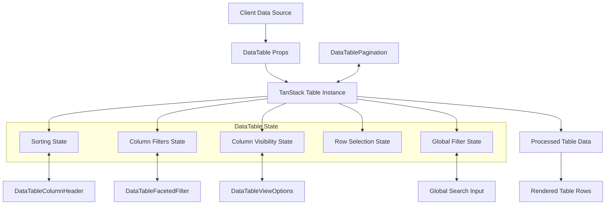
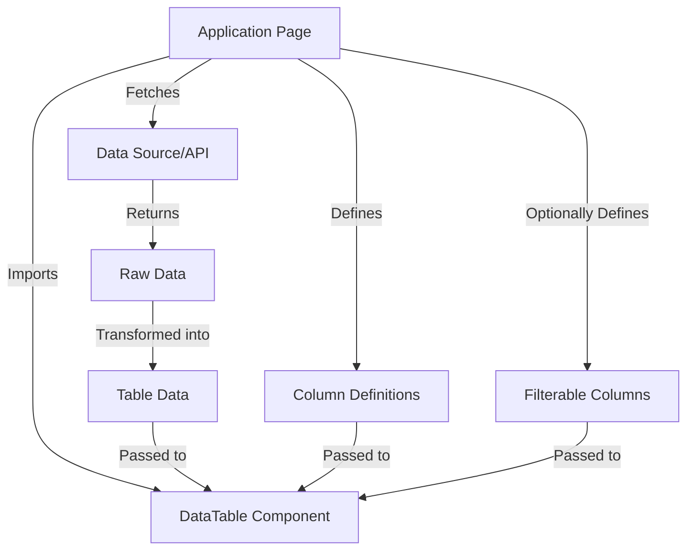

## Key Features
- **Smart Filtering**: Global search and column-specific filtering options
- **Multi-level Sorting**: Sort by multiple columns with priority indicators
- **Responsive Pagination**: Navigate through large datasets with customizable page sizes
- **Column Management**: Show/hide columns based on your needs
- **Adaptive Design**: Optimized for all screen sizes
- **Theme Support**: Light and dark mode with system preference detection
- **Accessibility**: Built with a11y in mind using Radix UI primitives

## Technology Stack
- **Framework**: Next.js 15 with App Router
- **UI Library**: React 19
- **Table Engine**: TanStack Table
- **UI Components**: Radix UI primitives
- **Styling**: Tailwind CSS
- **Typography**: Geist font family
- **Development**: Turbopack for fast refresh
- **Type Safety**: TypeScript

## Setup Instructions

### Prerequisites
- Node.js (v22.15.1 or higher)
- Git
- pnpm

### Getting Started
<p> 1. <strong>Clone the repository</strong>: Clone this repository to your local machine using the following command: </p>

```bash
git@github.com:anishshobithps/datacanvas.git
```
<p> 2. Change into the project directory: </p>

```bash
cd datacanvas
```
<p> 3. Install the dependencies: </p>

```bash
pnpm install
```
<p> 4. Start the development server: </p>

```bash
pnpm dev
```
> [!NOTE]
> The application will be available at http://localhost:3000

## Project Structure
The application follows a modular architecture with clear separation of concerns:

- `app/`: Next.js App Router pages and layouts
- `components/`: Reusable UI components
    - `data-table/`: Core table components
    - `ui/`: Base UI elements
- `lib/`: Utilities and type definitions

## Data Flow Diagram



## Integration Overview Diagram


